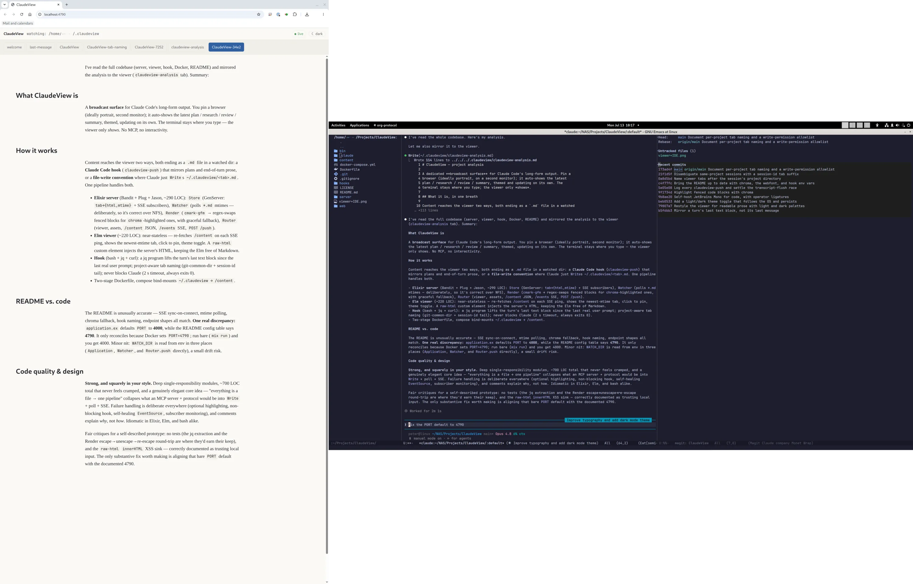

# ClaudeView

A dedicated, auto-updating **broadcast surface** for Claude Code's long-format
output — plans, research findings, code reviews, backlogs, sprint suggestions.

Pin a browser full-screen (ideally portrait) on a second monitor and let it
*show* the latest long content, nicely themed, updating on its own. Your terminal
stays the place you interact; the viewer is where you read.

No MCP and no interactivity: content reaches the viewer automatically via Claude
Code hooks, **plus** a "Claude opens a tab by writing a file" convention.



## How it works

```
  Claude Code host                          Server (Docker)            Monitor
  ────────────────                          ───────────────            ───────
  hook: ExitPlanMode ─┐                  ┌── Watcher (poll mtimes) ──┐
  hook: Stop ─────────┼─► claudeview-push│      cmark + chroma       │
  Claude Write tool ──┘   (jq+curl)      │           ▼               │
        writes content/<tab>.md  ──local─┼──► Store (tab→html) ──► SSE ─► Elm viewer
        or POST /push?tab=<tab> ──remote─┘                              (kiosk browser,
                                                                         portrait)
```

Three ideas keep it small:

- **Everything is a file in `WATCH_DIR`.** A local hook writes the file directly;
  a remote hook `POST`s and the server writes the file into its own `WATCH_DIR`.
  Either way the watcher renders it with `cmark-gfm`, highlights fenced code with
  `chroma`, and pushes an SSE ping; the
  Elm viewer then fetches the current snapshot and re-renders. One rendering
  pipeline, one content store.
- **Each `.md` file in `WATCH_DIR` is a tab**, newest-modified auto-focused. That
  is the whole "Claude controls the viewer" mechanism — Claude just uses the
  `Write` tool it already has. No plugin, no protocol. When a session tab is
  rewritten within `JOIN_WINDOW_S`, its new content is appended below the old
  rather than replacing it, so two quick writes in one turn both survive.
- **The watcher polls file mtimes** rather than using inotify: polling is simpler
  *and* correct over NFS (where inotify is unreliable), so the same code path
  serves a local directory and a home-lab NFS mount.

## Requirements

- **Docker** with the Compose plugin (server dependencies are all contained in
  the image — Elixir, Elm, `cmark-gfm` and `chroma`).
- **`jq`** and **`curl`** on the machine running Claude Code — the only host
  dependencies, used by the hook script.
- A **Chromium-family browser** (`google-chrome`, `chromium`, …) for the viewer
  window; any browser can open the URL, but the launch script wants `--app`.

## Quick start

```sh
git clone <this-repo> ClaudeView
cd ClaudeView
mkdir -p ~/.claudeview                 # the watched dir; create it as you, not root
docker compose up --build -d
```

The container watches **`~/.claudeview`** (the default the hook writes to as well).
Creating it yourself first keeps it owned by you — otherwise Docker creates the
bind-mount path as `root` and the hook can't write to it.

The viewer listens on **port 4790** by default (chosen to dodge the usual
3000/4000 collisions). Override the host port with `CLAUDEVIEW_HOST_PORT`, e.g.
`CLAUDEVIEW_HOST_PORT=5000 docker compose up -d`.

Open the viewer as a dedicated, chromeless, full-screen window:

```sh
bin/claudeview-open
```

The viewer's header shows which directory it is watching and whether the live
connection is up. Prove it works without Claude:

```sh
echo "# Hello" > ~/.claudeview/scratch.md            # a 'scratch' tab appears
curl -X POST 'http://localhost:4790/push?tab=note' \
     --data-binary '# Pushed over HTTP'              # a 'note' tab appears
```

### Portrait monitor

Rotate the target monitor to portrait at the OS level (not in the browser):

```sh
xrandr --output DP-0 --rotate left        # X11 (use your output's name)
wlr-randr --output DP-0 --transform 90    # Wayland (wlroots)
```

`bin/claudeview-open` places the window at `0,0` by default; set
`CLAUDEVIEW_POS="x,y"` to target a monitor that sits elsewhere in your layout.

## Wire up the hooks

Merge `hooks/settings.snippet.json` into `~/.claude/settings.json`, editing the
two absolute paths to point at your checkout. It wires:

- **`PreToolUse` / `ExitPlanMode`** → `claudeview-push plan` — mirrors a plan the
  moment Claude presents it, **before** you approve, so you review it on the big
  screen while deciding. (`PostToolUse` would fire only *after* approval — too
  late.)
- **`Stop`** → `claudeview-push last-message` — mirrors the last block of prose
  Claude leaves on screen at the end of a turn (research, reviews, analysis —
  anything long). A turn almost always *ends* with a tool call, so the hook takes
  the last **text** block of the turn, not the last message. Trivial tails like
  "Done." are skipped: only messages of at least `CLAUDEVIEW_MIN_CHARS`
  characters (default `200`, roughly a paragraph) are mirrored. Because the `Stop`
  event can fire while Claude is still flushing that final block, the hook first
  waits `CLAUDEVIEW_SETTLE` seconds (default `0.5`); this narrows — but cannot
  fully close — a race that otherwise mirrors the preceding lead-in sentence. For
  content that *must* appear, write the file yourself (see the next section).

By default the hook writes to **`~/.claudeview`** — the same directory the
container watches — so no environment variable is required. To send elsewhere,
set one of:

- `CLAUDEVIEW_DIR=/some/dir` — write `<tab>.md` there instead (also update the
  compose mount if you want the server to watch it).
- `CLAUDEVIEW_URL=http://host:4790` — HTTP `POST` (remote / home-lab).

The script uses a 2-second curl timeout and always exits 0, so a viewer that is
down never blocks Claude. Every run appends its outcome (written / skipped / POST
failed) to `~/.claudeview/.push.log` (override with `CLAUDEVIEW_LOG`), so a viewer
that stays dark is one `tail` away from an explanation. Hooks are read at session
start, so open a **new** Claude Code session for them to take effect.

## Let Claude open a tab on purpose

Add a line like this to your project `CLAUDE.md`:

> To display something on the ClaudeView viewer, write it to
> `~/.claudeview/<tab>.md` (kebab-case) — each file is a tab. Lead the name with
> the project you are working in, so a viewer shared by several sessions shows
> which one wrote each tab, e.g. `myproject-plan.md`, `myproject-review.md`.
> Reuse a stable name so an update replaces the tab instead of spawning a new one.

Claude then curates the viewer with the ordinary `Write` tool — no MCP. This is
the **most reliable** path: unlike the `Stop` hook it does not depend on session
lifecycle or transcript timing, so it behaves the same in foreground, background
and away sessions. It mirrors the hook's own naming (see
[Notes](#notes-and-limitations)): both lead the tab with the project.

### Approve the writes once, for every session

`~/.claudeview` sits outside your project, so Claude asks before writing there.
Pre-approve it for **all** sessions by adding to `~/.claude/settings.json`
(user scope applies to every project):

```json
{
  "permissions": {
    "allow": [
      "Write(~/.claudeview/**)",
      "Edit(~/.claudeview/**)"
    ]
  }
}
```

`Write` and `Edit` are separate tools, so both rules are needed; `**` covers
every file under the directory. If you point the viewer elsewhere with
`CLAUDEVIEW_DIR`, match that path instead — a leading `//` denotes an absolute
path, e.g. `Write(//mnt/nfs/claudeview/**)`.

## Diagrams and images

A tab is Markdown, so beyond prose, tables and highlighted code it can carry
**diagrams** and **images** — both rendered server-side, self-contained, no
browser-side JavaScript.

- **Diagrams** render to inline SVG. Three fenced-block languages are recognised:

  - ` ```mermaid ` — rendered by [`mmdr`](https://github.com/1jehuang/mermaid-rs-renderer),
    a native Rust renderer (no headless browser);
  - ` ```dot ` (or ` ```graphviz `) — rendered by Graphviz `dot`;
  - ` ```svg ` — SVG you authored, passed straight through.

  A block that fails to render — an unknown binary, a syntax error — is left as
  its **verbatim source text**, never a broken image. So the feature is safe to
  lean on: worst case you see the diagram's source.

- **Images** are files you drop into `WATCH_DIR` beside the `.md`, referenced with
  ordinary Markdown: ``. The server serves them from `/media`
  (relative links are rewritten there automatically). Absolute `http(s)://` and
  `data:` URIs are left untouched — note a remote URL is fetched fresh on every
  render, so a local file is the private, offline-friendly choice.

## Start the viewer automatically on login

`docker compose up -d` plus the `restart: unless-stopped` policy already brings
the **server** back after a reboot (as long as Docker starts on boot). To bring
the **browser window** up automatically too, add an XDG autostart entry that runs
the launch script — create `~/.config/autostart/claudeview.desktop`:

```ini
[Desktop Entry]
Type=Application
Name=ClaudeView
Exec=/path/to/ClaudeView/bin/claudeview-open
X-GNOME-Autostart-enabled=true
```

(Adjust the path to your checkout. Most desktop environments read this location;
some use their own autostart mechanism instead.)

## Roadmap: run the server on the home lab

The prototype runs locally, but nothing is local-only:

1. Deploy the same image to the home-lab Docker host.
2. Point `WATCH_DIR` at an NFS-mounted content path
   (`WATCH_DIR=/mnt/nfs/claudeview`). mtime polling works over NFS by design.
3. On the Claude Code host, set `CLAUDEVIEW_URL=http://homelab:4790` so hooks
   `POST` over the network — **or** write straight to the NFS mount with
   `CLAUDEVIEW_DIR`. Both feed the same watcher.

## Configuration

| Env var | Default | Meaning |
|---|---|---|
| `PORT` | `4790` | HTTP port the server listens on (inside the container). |
| `CLAUDEVIEW_HOST_PORT` | `4790` | Host port `docker compose` publishes the viewer on. |
| `WATCH_DIR` | `content` | Directory the watcher polls; `POST /push` writes here. Compose sets it to `/content` (the mount of `~/.claudeview`). |
| `CLAUDEVIEW_LABEL` | value of `WATCH_DIR` | Host-facing path shown in the viewer's header (the container only sees `/content`). |
| `POLL_MS` | `1000` | Poll interval in milliseconds. |
| `JOIN_WINDOW_S` | `120` | A session tab rewritten within this many seconds of its previous write is *joined* (new content appended below a rule) rather than replaced, so two quick writes don't clobber each other. |
| `JOIN_PATTERN` | `-[0-9a-f]{4,}$` | Which tab names join: by default session-shaped names ending in `-<hex>` (e.g. `-7f18`). Plans and prose tabs don't match, so they always replace. |
| `WEB_DIR` | `priv/web` | Where `index.html` / `elm.js` / `theme.css` / webfonts are served from. |

Hook environment variables (set on the machine running Claude Code):

| Env var | Default | Meaning |
|---|---|---|
| `CLAUDEVIEW_DIR` | `~/.claudeview` | Directory the hook writes `<tab>.md` into (file-delivery mode). |
| `CLAUDEVIEW_URL` | *(unset)* | If set, the hook `POST`s to `<url>/push` instead of writing a file (remote / home-lab). |
| `CLAUDEVIEW_MIN_CHARS` | `200` | Floor for `last-message`; shorter final blocks are skipped. |
| `CLAUDEVIEW_SID_CHARS` | `4` | Length of the session-id tail appended to the tab name so same-project sessions stay apart; `0` disables it. |
| `CLAUDEVIEW_SETTLE` | `0.5` | Seconds `last-message` waits before reading the transcript, to let the turn's final block flush. `0` disables. |
| `CLAUDEVIEW_LOG` | `~/.claudeview/.push.log` | Breadcrumb log each invocation's outcome is appended to. |

Launcher environment variables (`bin/claudeview-open`, set on the viewer machine):

| Env var | Default | Meaning |
|---|---|---|
| `CLAUDEVIEW_URL` | `http://localhost:4790` | Viewer URL the browser window opens. |
| `CLAUDEVIEW_POS` | `0,0` | Window position `x,y` (target a monitor elsewhere in the layout). |
| `CLAUDEVIEW_PROFILE` | `~/.claudeview-profile` | Dedicated browser profile dir, kept separate from your everyday browser. |

## Endpoints

| Method | Path | Purpose |
|---|---|---|
| `GET` | `/` | The Elm viewer. |
| `GET` | `/assets/<name>` | Static assets (`elm.js`, `theme.css`, webfonts). |
| `GET` | `/events` | SSE stream; emits `data: changed` on any content change (and once on connect). |
| `GET` | `/content` | JSON snapshot: `{tabs: [{name, html, mtime}], focus, watching: [dir, …]}`. |
| `GET` | `/media/<name>` | An image file from `WATCH_DIR`, for Markdown ``. |
| `POST` | `/push?tab=<name>` | Write the request body to `<name>.md` in `WATCH_DIR`. |

## Project layout

| Path | What it is |
|---|---|
| `server/` | Elixir app (Bandit + Plug + Jason). Watches `WATCH_DIR`, renders via `cmark-gfm` (GFM tables, task lists, …), highlights fenced code via `chroma`, renders `mermaid`/`dot`/`svg` blocks to inline SVG (`mmdr`/`graphviz`), serves SSE + the viewer. |
| `web/` | Elm viewer (`Main.elm`) + `index.html` bootstrap + `theme.css` (light/dark palettes, syntax colours) + the bundled JetBrains Mono webfont (`*.woff2`, SIL OFL). |
| `hooks/claudeview-push` | Bash + jq + curl. Mirrors plans / final answers to the viewer. |
| `hooks/settings.snippet.json` | Hook wiring to merge into `~/.claude/settings.json`. |
| `bin/claudeview-open` | Opens the viewer as a dedicated, full-screen browser window. |
| `content/welcome.md` | Seed tab; copy it into `~/.claudeview` on first run. The live `WATCH_DIR` is `~/.claudeview`, not this folder. |
| `Dockerfile` / `docker-compose.yml` | Contained build (Elm + Elixir + cmark-gfm + chroma + graphviz + mmdr), plus the `tools` stage that runs the checks below. |
| `Makefile` / `githooks/` | The code-quality tool chain and its opt-in git hooks (see Development). |

## Development

Formatting, linting and type checking all run **inside a pinned Docker image**
(the `tools` stage), so the host needs only Docker and `make` — no local Elixir,
Elm or shellcheck, and no version drift between machines.

```sh
make tools          # once: build the image, warm the hex/rebar/deps caches
make install-hooks  # once, optional: run the checks on commit and push
make format         # apply every formatter in place
make check          # the full gate — format, compile, type-check, lint
```

What the gate covers, each with its language's canonical tool:

| Language | Format | Static check |
|---|---|---|
| Elixir | `mix format` | `mix compile --warnings-as-errors`, `mix credo --strict` |
| Elm | `elm-format` | `elm make` (the compiler is the type checker) |
| Bash | `shfmt` | `shellcheck` |

The git hooks are opt-in via `core.hooksPath` (set by `make install-hooks`,
undone by `git config --unset core.hooksPath`). `pre-commit` runs the fast half
(`make check-fast`: formatting + shell lint); `pre-push` runs the full
`make check`. Bypass either once with `--no-verify`.

## Notes and limitations

- **Tabs are named per project and session.** The hook names each tab after the
  session's project — the git repo directory (so a bare-repo + worktree layout
  reports the repo, not the branch-named worktree), or `basename(cwd)` outside a
  repo — plus a short session-id tail so two sessions in the *same* project do
  not share a tab (`myproject-a3f9`, `myproject-a3f9-plan`). Set
  `CLAUDEVIEW_SID_CHARS=0` to drop the tail. Manual `Write`s follow the same
  convention by leading the filename with the project.
- **`last-message` skips short turns** by design: a turn whose last text block is
  under `CLAUDEVIEW_MIN_CHARS` (or which emits no prose at all) produces no tab,
  so trivial acknowledgements never clobber the last long answer you were reading.
- **`last-message` mirrors the turn's *last* text block** — faithful to what
  ended on screen, but that can be a short procedural lead-in ("let me update the
  plan…") rather than the substantial summary above it. `CLAUDEVIEW_SETTLE` eases
  the related flush race; writing the file yourself avoids both.
- Rendering treats content as trusted (local files / your own Claude sessions):
  `cmark-gfm` output and `chroma`'s highlighted spans are injected as-is. For
  untrusted input, enable `cmark-gfm`'s `tagfilter` extension in
  `server/lib/claudeview/render.ex`.

## Future improvements

- **Group tabs by an explicit project field, not the first `-` segment.** The
  viewer folds tabs into one split-button per project by taking the first
  `-`-delimited token of the tab name, so a repo whose name contains a hyphen
  (`my-cool-repo`) is split across a `my` group. Emitting the project as its own
  field — from the push hook, carried through `/content` — would group reliably
  regardless of hyphens.
- **Keep a manually opened document pinned across content changes.** Selecting
  an older document (a `plan`, say) gives way to the project's newest-modified
  tab on the next watched-file change, because every SSE ping re-adopts the
  server's focus. A sticky "the user picked this" flag that survives refetches
  would let you keep reading an older tab without it being pulled away.

## Deliberately out of scope

- MCP server (excluded by design; the file convention replaces it).
- Interactive questions / two-way control — this surface only *shows*.
- `mix release` slimming; the prototype runs `mix run --no-halt`.
- A `Write`-matcher hook for `docs/**.md` (easy to add later).

## License

[MIT](LICENSE) © Virtual Void Stockholm AB
